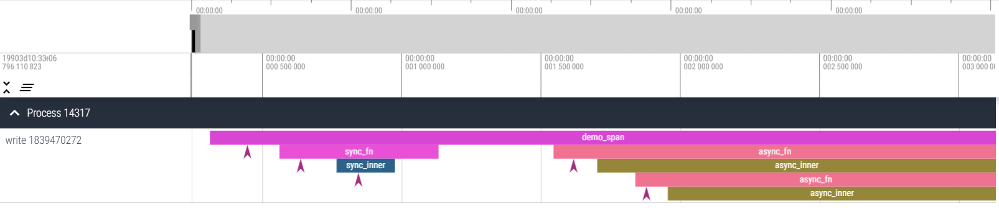

tracing-perfetto
======

# Overview

tracing-perfetto is a Layer for [tracing-subscriber](https://crates.io/crates/tracing-subscriber) that outputs traces in perfetto's trace packet format that can be viewed with [ui.perfetto.dev](https://ui.perfetto.dev).

# Usage

Add this near the beginning of `main`:
```rust
use tracing_perfetto::PerfettoLayer;
use tracing_subscriber::{registry::Registry, prelude::*};

let layer = PerfettoLayer::new(std::sync::Mutex::new(std::fs::File::create("/tmp/test.pftrace").unwrap()));
tracing_subscriber::registry().with(layer).init();
```
Open that file with [ui.perfetto.dev](https://ui.perfetto.dev):



# License

Licensed under the [MIT license](http://opensource.org/licenses/MIT)
